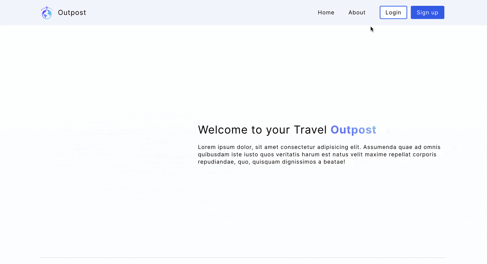

<div id="top"></div>

<!-- PROJECT LOGO -->
<br />
<div align="center">
  <a href="https://github.com/danjkim21/outpost-app">
    
  </a>

<h3 align="center">Outpost</h3>

  <p align="center">
    A CRUD app that allows users to create and log travel plans, keep track of dates and important flights, and save notes.
    <br />
    <a href="https://github.com/danjkim21/outpost-app"><strong>Explore the docs »</strong></a>
    <br />
    <br />
    <a href="https://outpost.cyclic.app/">View Demo</a>
    ·
    <a href="https://github.com/danjkim21/outpost-app/issues">Report Bug</a>
    ·
    <a href="https://github.com/danjkim21/outpost-app/issues">Request Feature</a>
  </p>
</div>

<!-- ABOUT THE PROJECT -->

## About The Project

<p align="center">
  
</p>

Like many others, traveling is stressful for me. Particularily when you are juggling multiple flights, accomodations, logistics, etc. I often find myself burning out on just planning the logistics than getting excited by looking for fun or interesting sites, attractions and good food! 

I created this app to organize my travel plans, keep track of flights and AirBnb/Hotel reservations, and things to do while traveling. That way I can spend more time actually traveling.

### How It's Made

**Tech used:**

- [Node.js](https://nodejs.org/en/)
- [Express](https://expressjs.com/)
- [MongoDB](https://www.mongodb.com/)
- [EJS](https://ejs.co/)


<!-- GETTING STARTED -->

## Getting Started

This app can be accessed via [https://outpost.cyclic.app/](https://outpost.cyclic.app/) or as a local copy. To get a local copy up and running follow these simple example steps.

### Installation

1. Create new MongoDB project and connect to your new project

2. Create a .env file and add your MongoDB connection string to it (DB_STRING)

3. Clone the repo
   ```sh
   git clone https://github.com/github_username/repo_name.git
   ```
4. Install NPM packages
   ```sh
   npm install
   ```

<!-- USAGE EXAMPLES -->

### Usage

1. Run server
   ```sh
    node server.js
    npm run start  // nodemon command
   ```
2. Navigate to server
   ```sh
   `localhost:8000`
   ```

<!-- ROADMAP -->

## Roadmap

- [x] Update "My Trips" Dashboard UI
- [x] Build out Trip Destination Modal content
- [x] Add Mobile Responsiveness
- [x] Build out shared trips feature
- [x] Build out "Explorer" feature
- [x] Build out User Profile feature
- [ ] Add "Destinations" Model to MVC (TBD)
- [ ] Integrate Google Maps API
- [ ] Add dark mode styling

See the [open issues](https://github.com/danjkim21/outpost-app/issues) for a full list of proposed features (and known issues).

## Lessons Learned:

I learned how to implement an MVC architecture to my application. Using an MVC architecture really helped me to understand the routing/controlling logic of a full stack application, and how the client, server, and database all interact. I also learned how great MVC architecture is for scaling projects and general maintainability.

<!-- CONTRIBUTING -->

## Contributing

If you have a suggestion that would make this better, please fork the repo and create a pull request. You can also simply open an issue with the tag "enhancement".

<!-- LICENSE -->

## License

Distributed under the MIT License. See `LICENSE.txt` for more information.

<!-- CONTACT -->

## Contact

Your Name - [@devdanielk](https://twitter.com/devdanielk) - dan.jkim21@gmail.com

Project Link: [https://github.com/danjkim21/outpost-app](https://github.com/danjkim21/outpost-app)

Live Link: [https://outpost.cyclic.app/](https://outpost.cyclic.app/)

<p align="right">(<a href="#top">back to top</a>)</p>
